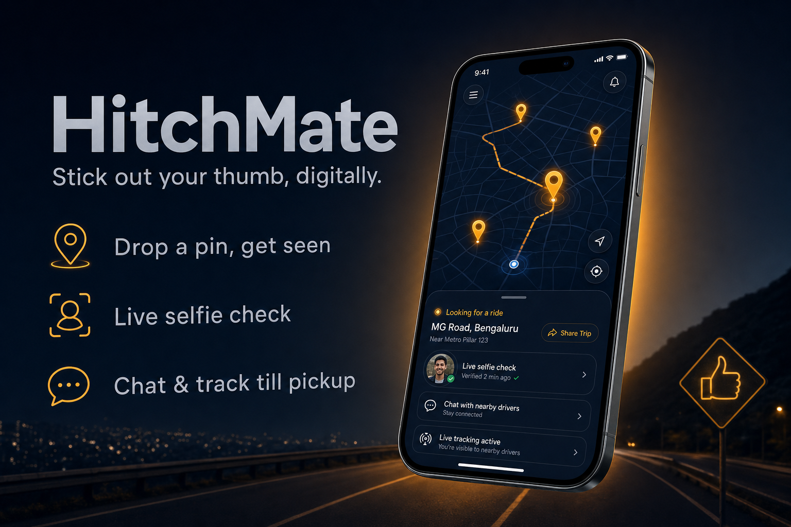

# HitchMate



_Product-concept mockup — an illustrative marketing render, not a literal screenshot of the live app._

**HitchMate** is a mobile-first, real-time map app for hitchhikers. Drop a pin, get seen by nearby drivers, and — once someone accepts — connect over live tracking and chat until you're picked up. Safety is built into the core, not bolted on.

## What it does

1. **Request a ride** — confirm your pickup spot (GPS auto-detects the address, with live autocomplete corrections). Nearby drivers see only an **approximate area**, never your exact location.
2. **Get matched** — a driver taps _Accept pickup_. Only then is your **exact location revealed** — and only to them, enforced at the database layer.
3. **Ride safe** — a required **live-selfie check** (center → turn → blink) deters fakes, in-app **chat** keeps you connected, and an **arrival card** shows the driver's photo, vehicle, and plate as they approach.

## Key features

- 🔐 **Google sign-in required** — accountability as the first safety layer
- 🤳 **Live-selfie liveness check** — on-device MediaPipe face mesh; only a photo is stored, never the video
- 📍 **Location fuzzing** — public pins snap to a ~300m grid; exact coordinates live in a private, RLS-protected table
- 🧭 **Driver navigation + real ETA** — one tap opens turn-by-turn in Google/Apple Maps; live "N min away" via the Routes API
- 🔗 **Share-a-trip** — send a friend a live link that follows your ride until pickup
- 📱 **Mobile-first** — full-screen map, thumb-reachable sheets, installable to the home screen

## Install

```bash
git clone https://github.com/Still-InFrame/day-42-hitchmate.git
cd day-42-hitchmate
npm install
npm run dev
```

Then fill in `.env.local`:

```bash
NEXT_PUBLIC_SUPABASE_URL=...            # your Supabase project URL
NEXT_PUBLIC_SUPABASE_ANON_KEY=...       # Supabase publishable key
NEXT_PUBLIC_GOOGLE_MAPS_API_KEY=...     # browser key: Maps JavaScript API + Places API (New), referrer-restricted
GOOGLE_ROUTES_API_KEY=...               # server key: Routes API + Geocoding API, no referrer restriction
```

## Stack

Next.js 16 (App Router, Turbopack) · TypeScript · Tailwind CSS v4 · Supabase (Postgres, RLS, Realtime, Storage, Auth) · Google Maps Platform (`@vis.gl/react-google-maps`, Places, Routes, Geocoding) · MediaPipe FaceLandmarker.

---

Part of a [100-day AI build challenge](https://www.100dayaichallenge.com/share/savion) — one new app a day.
